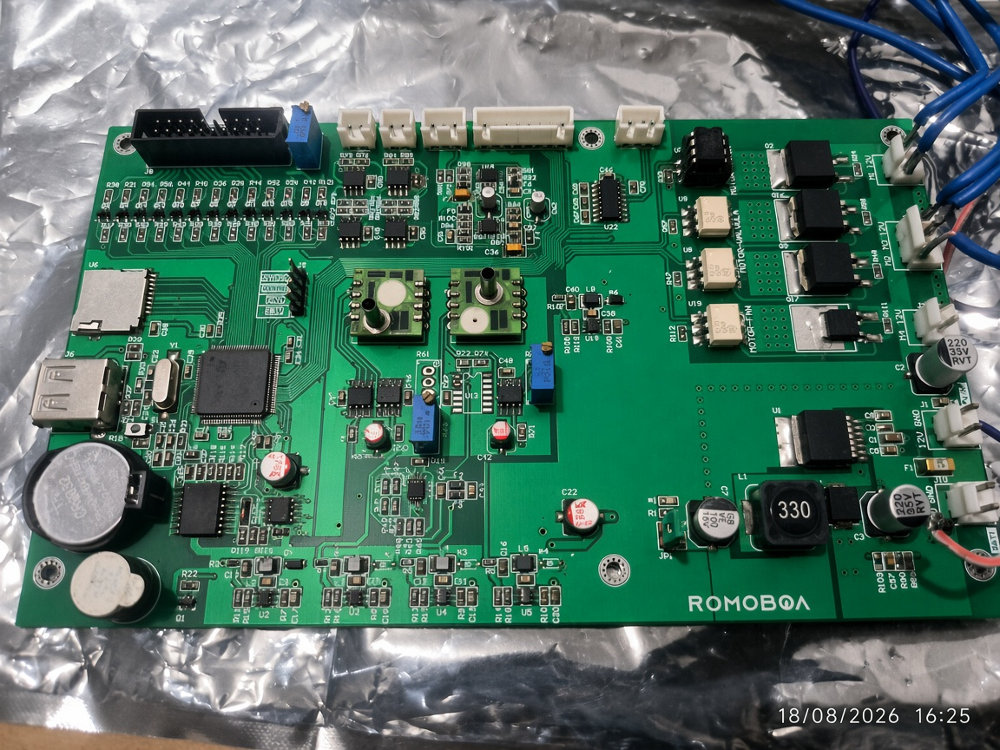
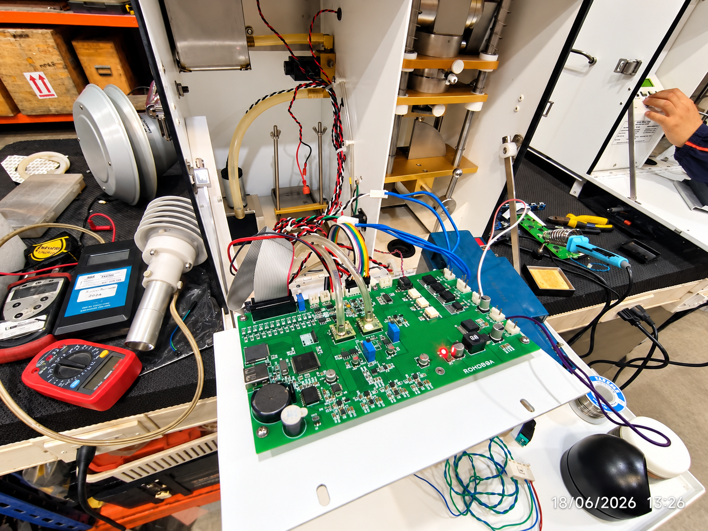
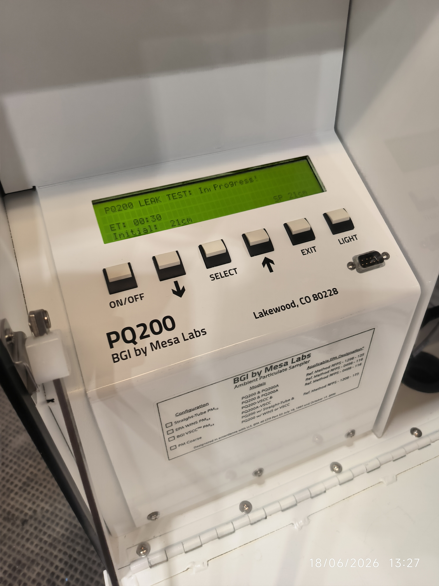

# 🌬️ Particle Sampler - LOWVOL BGI PQ200 Replica

This project was developed for **ROMOBOA** and consists of a custom board that replicates the functions of the **LOWVOL-BGI PQ200 particle sampler**.  
The system was designed to reproduce the same sampling actions, control logic, and measurement processes used in professional air quality monitoring equipment.

---

## 📁 Project Structure

The repository is organized as follows:

* **`firmware/`**: Embedded code (Keil uVision V1.0) for controlling the particle sampler board.
* **`docs/`**: Technical documentation, schematics, and deployment notes.
* **`images/`**: Photographic records of PCB design, connections, and testing.

---

## 🛠️ Hardware and Connections

### PCB Design
Custom PCB developed to replicate the control and sampling functions of the PQ200.  

### PCB Connection
Wiring and integration of sensors, pumps, and control electronics.  

---

## 🚀 Development and Testing

### Firmware Development
Firmware created in **Keil uVision V1.0**, implementing the same sampling cycles and control routines as the PQ200.

### Testing Phase
Validation of airflow, timing, and sampling accuracy compared to the reference device.  

---

## 📊 Replicated Functions

The ALS board reproduces the following actions of the PQ200 sampler:

- **Airflow control** for particle sampling.  
- **Timing cycles** for programmed sampling intervals.  
- **Sensor integration** for monitoring operational parameters.  
- **Data acquisition and logging** for analysis.  

---

## 📋 Requirements and Setup

### Firmware
1. Open the `firmware/codigo_uvision_V1.0` project in Keil uVision.  
2. Compile and flash the firmware to the microcontroller.  
3. Connect the PCB to the sampling hardware and verify operation.

### Documentation
Refer to the `docs/` folder for schematics and technical notes.

---

## ✨ Features
- Custom PCB replicating PQ200 particle sampler actions.  
- Embedded firmware for control and timing cycles.  
- Hardware validation through testing and comparison.  
- Clear documentation and photographic records.  

---

## 📄 License
This repository contains proprietary code and documentation.  
Unauthorized use, distribution, or modification is strictly prohibited.

